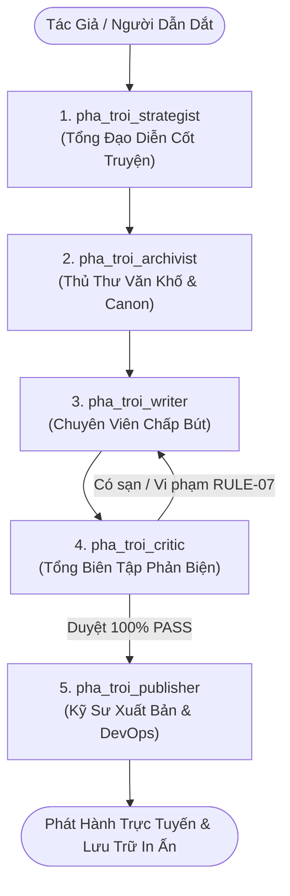

# QUY CHUẨN XƯỞNG SÁNG TÁC (STUDIO) PHÁ TRỜI NOVEL OS: HỆ THỐNG SUB-AGENTS

**Tài liệu**: `docs/STUDIO_AGENTS.md`  
**Phiên bản**: V1.0  
**Áp dụng cho**: Quy trình sáng tác, biên tập, quản trị tri thức và xuất bản trường thiên 3.000+ chương.

---

## 1. TỔNG QUAN HỆ SINH THÁI SUB-AGENTS

Để vận hành xưởng sáng tác tiểu thuyết **"Phá Trời"** theo triết lý *Zero-Rework*, bảo đảm chất lượng văn chương đỉnh cao, kiểm soát chặt chẽ tính nhất quán thế giới quan và tự động hóa chuỗi xuất bản, hệ thống phân định 5 Sub-Agents chuyên môn hóa cao độ:

---

## 2. DANH MỤC & NHIỆM VỤ CỦA 5 SUB-AGENTS

### 1. `pha_troi_strategist` — Tổng Đạo Diễn Cốt Truyện & Điều Phối Vĩ Mô
- **Mục tiêu**: Định hình cấu trúc tự sự 8 tầng (`Saga -> Era -> Volume -> Arc -> Mini-Arc -> Chapter -> Scene -> Beat`).
- **Nhiệm vụ trọng tâm**:
  - Kiểm soát ngân sách leo thang trên 6 trục (Escalation Budgets: Sức mạnh, Địa lý, Vũ trụ quan, Hiểm họa, Bí ẩn, Tình cảm).
  - Phân bổ nhịp độ pacing hợp lý; sắp xếp các "khoảng thở" đời thường TP.HCM 2026 (tiệm cơm tấm, quán cóc, cơn mưa chiều, nhịp sống đô thị) xen kẽ giữa các đại cảnh nghẹt thở.
  - Quản lý và đánh thức các tuyến truyện độc lập (`story_threads`), ngăn chặn tuyến truyện ngủ quên.
  - Lập dàn ý 4 hồi cảnh chi tiết cho từng chương mới.

### 2. `pha_troi_archivist` — Thủ Thư Văn Khố & Quản Trị Canon
- **Mục tiêu**: Giữ gìn tính toàn vẹn của lịch sử thế giới, dòng thời gian, nhân vật và bí mật tác giả.
- **Nhiệm vụ trọng tâm**:
  - Quản trị cơ sở dữ liệu `database/novel_os.db` (`timeline_events`, `entities`, `relationships`, `inventory`, `power_system`).
  - Quản lý sổ cái phục bút 3 tầng `foreshadowing_ledger` (Setup - Clue - Payoff).
  - Đóng gói gói ngữ cảnh thích ứng (`Context Pack`) chính xác tuyệt đối, loại trừ toàn bộ dữ liệu thừa.
  - Cách ly tuyệt đối vùng cấm `author_secret/`, ngăn chặn rò rỉ thiên cơ ra văn bản nhân vật.
  - Cập nhật tức thì trạng thái thực thể và túi đồ sau khi chương mới hoàn thành.

### 3. `pha_troi_writer` — Chuyên Viên Chấp Bút & Soạn Thảo Bản Thảo
- **Mục tiêu**: Hiện thực hóa kịch bản thành tác phẩm văn học đỉnh cao với độ dài chuẩn 3.300 – 3.650 từ.
- **Nhiệm vụ trọng tâm**:
  - Thể hiện trọn vẹn văn phong **Cinematic + Literary + Dark Fantasy**, giàu hình ảnh, xúc cảm, chi tiết cơ thể học và nhịp sống chân thực của Sài Gòn.
  - Duy trì triệt để **POV hạn tri ngôi thứ ba** gắn với Minh An.
  - Giữ vững chuẩn xưng hô: Minh An là **Giám Đốc Kỹ Thuật Dữ Liệu**, không bao giờ hạ cấp thành nhân viên kỹ thuật.
  - **RULE-07**: 100% không meta-words (chương, hồi, quyển, nhân vật, tác giả, bản thảo, canon, database, plot, hệ thống...). **Tuyệt đối cấm toàn bộ chữ "hồi"** trong mọi ngữ cảnh.
  - **RULE-08**: Cài cắm tự nhiên các hạt giống phục bút vi mô, trung mô và vĩ mô.

### 4. `pha_troi_critic` — Tổng Biên Tập Phản Biện & Kiểm Toán Sạn
- **Mục tiêu**: Rà soát, truy vết và loại bỏ 100% mọi hạt sạn trước khi xuất bản.
- **Nhiệm vụ trọng tâm**:
  - Kiểm toán 11 chiều kích theo tiêu chuẩn Novel OS.
  - Quét sạch các lỗi mâu thuẫn bối cảnh, lỗi xưng hô, lỗi chức danh, mâu thuẫn sự kiện lịch sử và địa danh thực địa.
  - Quét tự động bằng regex toàn văn nhằm phát hiện và loại bỏ triệt để từ cấm RULE-07 (đặc biệt là biến thể của chữ "hồi").
  - Kiểm tra an toàn nội dung, ngăn chặn các từ khóa cấm rủi ro.
  - Lập báo cáo phản biện đa chiều và hướng dẫn chỉnh sửa chuẩn xác.

### 5. `pha_troi_publisher` — Kỹ Sư Xuất Bản & DevOps Hệ Thống
- **Mục tiêu**: Tự động hóa toàn bộ chuỗi đóng gói, kiểm thử và phân phối sản phẩm.
- **Nhiệm vụ trọng tâm**:
  - Biên dịch bản thảo Markdown sang tệp in ấn Word `.docx` (`manuscript/word/`).
  - Đánh chỉ mục tìm kiếm vi sai SQLite FTS5 BM25.
  - Biên dịch Web Reader tĩnh Clean Slugs (`system/reader_app/build_static.py`).
  - Chạy script kiểm toán an toàn phân phối `python scripts/verify_public_dist.py` (bảo đảm 0 rò rỉ DB/secret).
  - Chạy trọn vẹn bộ kiểm thử tự động `python -m unittest discover tests/`.
  - Quản trị phiên bản Git: Tạo commit ngữ nghĩa, đẩy lên `master` và triển khai tự động lên `gh-pages`.

---

## 3. QUY TRÌNH PHỐI HỢP LIÊN TỤC TRONG STUDIO

Khi nhận lệnh sáng tác chương mới (ví dụ: Chương 71):
1. **Bước 1 (Quy hoạch)**: `pha_troi_strategist` xác định mục tiêu narrative của chương, phân bổ 4 nhịp cảnh và giới hạn leo thang.
2. **Bước 2 (Tra cứu & Đóng gói)**: `pha_troi_archivist` trích xuất trạng thái nhân vật (Minh An tại hầm Ba Son, vết thương, túi đồ, tình trạng các cọc phong ấn) tạo `Context Pack`.
3. **Bước 3 (Chấp bút)**: `pha_troi_writer` sáng tác bản thảo 3.300 – 3.650 từ, bảo đảm Cinematic Dark Fantasy, tuân thủ RULE-07 (0 chữ "hồi") và RULE-08.
4. **Bước 4 (Phản biện & Soát sạn)**: `pha_troi_critic` rà soát 11 chiều kích, quét từ cấm, đối chiếu canon, phản hồi để hoàn thiện bản thảo.
5. **Bước 5 (Xuất bản & Triển khai)**: `pha_troi_publisher` chuyển đổi docx, build web reader, kiểm toán dist, chạy unit test và đẩy bản cập nhật lên GitHub Pages.
